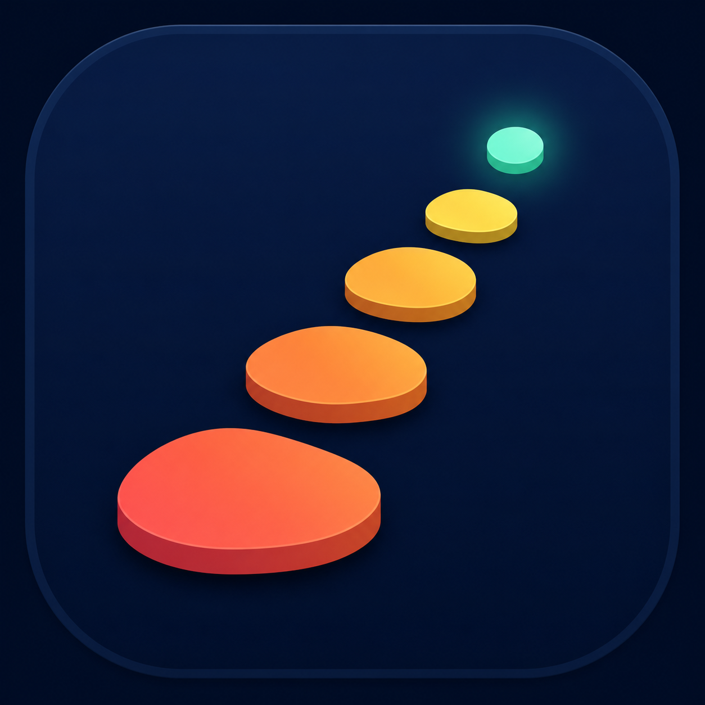

<p align="center">
  
</p>

<h1 align="center">Paseito</h1>

<p align="center">
  Independent Apple Silicon macOS fork of Paseo, with separate app state, daemon, port, CLI,
  updates, URL scheme, and icon. See <a href="NOTICE-PASEITO.md">the modification notice</a> and
  <a href="docs/paseito-automation.md">automation design</a>.
</p>

<p align="center">
  <a href="README.md">English</a> ·
  <a href="README.zh-CN.md">简体中文</a> ·
  <a href="README.ja.md">日本語</a> ·
  <a href="README.ko.md">한국어</a>
</p>

<p align="center">
  <a href="https://github.com/walter-erquinigo/paseito/stargazers">
    
  </a>
  <a href="https://github.com/walter-erquinigo/paseito/releases">
    
  </a>
  <a href="https://x.com/moboudra">
    
  </a>
  <a href="https://discord.gg/jz8T2uahpH">
    
  </a>
  <a href="https://www.reddit.com/r/PaseoAI/">
    
  </a>
</p>

<p align="center">One interface for Claude Code, Codex, Copilot, OpenCode, and Pi agents.</p>

<p align="center">
  
</p>

<p align="center">
  
</p>

Run agents in parallel on your Apple Silicon Mac while keeping Paseo installed independently.

- **Self-hosted:** Agents run on your machine with your full dev environment. Use your tools, your configs, and your skills.
- **Multi-provider:** Claude Code, Codex, Copilot, OpenCode, and Pi through the same interface. Pick the right model for each job.
- **Voice control:** Dictate tasks or talk through problems in voice mode. Hands-free when you need it.
- **Independent:** Paseito uses its own application data, daemon state, port, URL scheme, CLI, and updater.
- **Privacy-first:** Paseito retains upstream's no-telemetry, no-tracking, and no-forced-login behavior.

## Getting Started

Paseito runs a local daemon on port `6769` that manages your coding agents. This fork publishes
only an Apple Silicon macOS desktop app with its bundled `paseito` CLI.

### Prerequisites

You need at least one agent CLI installed and configured with your credentials:

- [Claude Code](https://docs.anthropic.com/en/docs/claude-code)
- [Codex](https://github.com/openai/codex)
- [GitHub Copilot](https://github.com/features/copilot/cli/)
- [OpenCode](https://github.com/anomalyco/opencode)
- [Pi](https://pi.dev)

### Desktop app (recommended)

Download the unsigned arm64 ZIP, checksum, and provenance file from the
[Paseito releases page](https://github.com/walter-erquinigo/paseito/releases). The local installer
verifies all three, applies an ad-hoc signature, and installs `/Applications/Paseito.app` without
altering Paseo.

The release is intentionally not Apple-notarized: notarization requires a paid Apple Developer
membership. The automated release and installer use only no-charge services.

### CLI / headless

The desktop bundle contains the CLI. Install it from Paseito's settings, then start the daemon:

```bash
paseito daemon start
```

Paseito defaults to `~/.paseito` and `127.0.0.1:6769`.

Paseito retains upstream package and environment-variable names where changing internal APIs would
create avoidable rebase conflicts. For upstream behavior and configuration, see:

- [Docs](https://paseo.sh/docs)
- [Connectivity guide](https://paseo.sh/docs/connectivity)
- [Configuration reference](https://paseo.sh/docs/configuration)

## CLI

Everything you can do in the app, you can do from the terminal.

```bash
paseito run --provider claude/opus-4.6 "implement user authentication"
paseito run --provider codex/gpt-5.4 --worktree feature-x "implement feature X"

paseito ls                           # list running agents
paseito attach abc123                # stream live output
paseito send abc123 "also add tests" # follow-up task

# run on a remote daemon
paseito --host workstation.local:6769 run "run the full test suite"
```

See the [full CLI reference](https://paseo.sh/docs/cli) for more.

## Development

Quick monorepo package map:

- `packages/server`: upstream-named daemon internals (agent orchestration, WebSocket API, MCP server)
- `packages/app`: Expo client (iOS, Android, web)
- `packages/cli`: source for the bundled `paseito` CLI
- `packages/desktop`: Electron desktop app
- `packages/relay`: Relay transport and encryption used by the daemon and clients
- `packages/website`: Marketing site and documentation (`paseo.sh`)

Common commands:

```bash
# run all local dev services
npm run dev

# run individual surfaces
npm run dev:server
npm run dev:app
npm run dev:desktop
npm run dev:website

# build the server stack
npm run build:server

# repo-wide checks
npm run typecheck
```

## Related projects

- [getpaseo/paseo-relay](https://github.com/getpaseo/paseo-relay) — official distributed relay, written in Elixir
- [paseo-skins](https://github.com/huangguang1999/paseo-skins) — community themes and a zero-patch desktop theme loader with an Agent Skill
- [paseo-vscode](https://marketplace.visualstudio.com/items?itemName=hinnes.paseo-vscode) — VS Code extension

## License

AGPL-3.0
